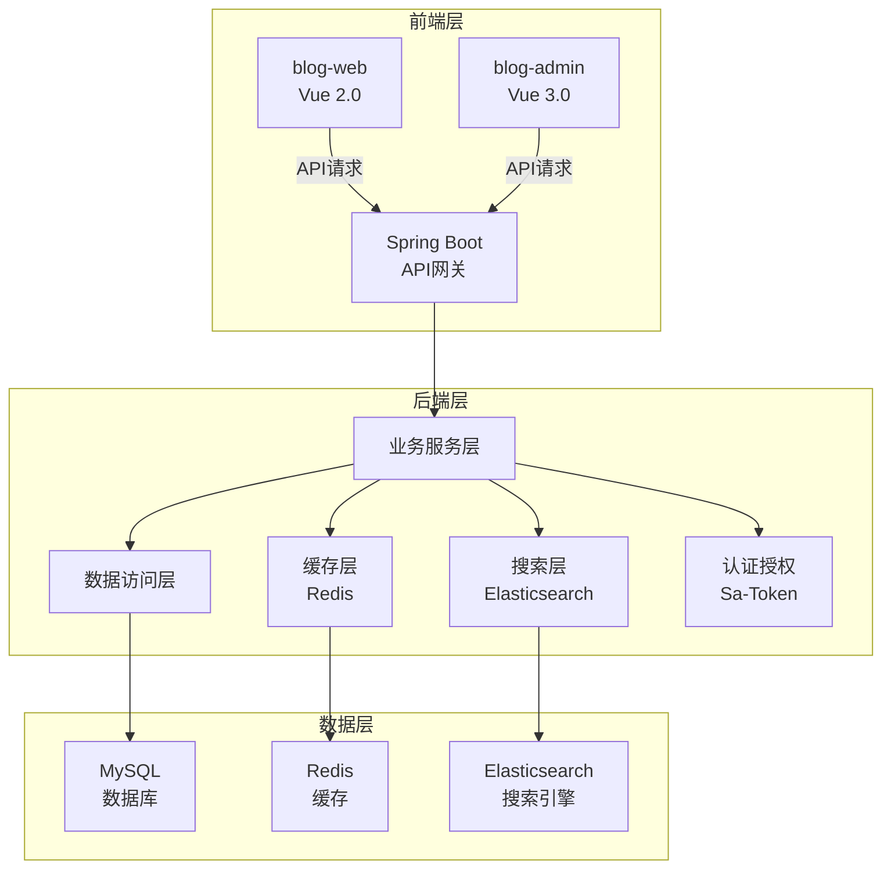

# 拾壹博客项目分析报告

## 1. 仓库概览

拾壹博客是一个功能完整的前后端分离博客系统，采用现代技术栈构建，支持丰富的博客功能和管理特性。

- **前后端分离架构**：后端基于 Spring Boot，前端采用 Vue 技术栈
- **丰富的功能特性**：支持 Markdown 编辑、代码高亮、评论系统、弹幕墙留言等
- **完整的管理系统**：基于 RBAC 模型的权限管理，支持动态菜单和权限配置
- **现代化技术栈**：整合了 Elasticsearch、Redis、WebSocket 等现代技术
- **多端适配**：响应式设计，支持桌面端和移动端

## 2. 目录结构

项目采用清晰的分层架构，前后端分离部署，后端模块化设计，前端分为管理端和门户端。

```text
├── blog/                 # 后端项目
│   ├── mojian-admin/     # 后台管理系统控制器模块
│   ├── mojian-api/       # 门户接口模块
│   ├── mojian-common/    # 通用模块
│   ├── mojian-auth/      # 认证模块
│   ├── mojian-file/      # 文件模块
│   ├── mojian-quartz/    # 定时任务模块
│   ├── mojian-server/    # 博客启动类模块
├── blog-admin/           # 后台管理系统前端
├── blog-web/             # 门户前端
├── README.md             # 项目说明文档
├── mj-blog.sql           # 数据库脚本
```

**核心模块职责**：

| 模块 | 主要职责 | 文件位置 |
| ---- | ------- | ------- |
| 后端管理模块 | 后台管理系统的控制器和服务 | blog/mojian-admin/ |
| 后端API模块 | 门户接口的控制器和服务 | blog/mojian-api/ |
| 前端管理系统 | 基于Vue 3.0的后台管理界面 | blog-admin/ |
| 前端门户系统 | 基于Vue 2.0的博客前台界面 | blog-web/ |

## 3. 系统架构与主流程

### 3.1 技术架构

项目采用典型的前后端分离架构，后端基于 Spring Boot 构建 RESTful API，前端通过 Vue 框架构建单页应用。



### 3.2 核心流程图

**用户访问流程**：
1. 用户通过浏览器访问博客前台或后台
2. 前端应用加载并初始化
3. 前端通过 API 向后端请求数据
4. 后端处理请求并返回数据
5. 前端渲染数据并展示给用户

**权限验证流程**：
1. 用户登录系统
2. 后端生成并返回 token
3. 前端存储 token 并在后续请求中携带
4. 后端验证 token 合法性
5. 基于 RBAC 模型验证用户权限

**文章发布流程**：
1. 管理员在后台编辑文章
2. 前端将 Markdown 内容发送到后端
3. 后端处理内容并存储到数据库
4. 后端同步文章索引到 Elasticsearch
5. 前端更新文章列表

## 4. 核心功能模块

### 4.1 文章管理模块

**功能描述**：支持文章的创建、编辑、发布、分类和标签管理，使用 Markdown 编辑器，支持代码高亮和图片上传。

**实现细节**：
- 后端：通过 `SysArticleController` 和 `SysArticleService` 实现文章的 CRUD 操作
- 前端：后台使用 mavon-editor 编辑器，前台支持 Markdown 渲染和目录生成

**核心代码**：
- 后端文章服务：blog/mojian-admin/src/main/java/com/mojian/service/impl/SysArticleServiceImpl.java
- 前端文章编辑：blog-admin/src/views/article/article/index.vue

### 4.2 用户管理模块

**功能描述**：基于 RBAC 模型的用户和权限管理，支持角色分配、权限配置和用户状态管理。

**实现细节**：
- 后端：使用 Sa-Token 实现认证，通过 `SysUserController` 和 `SysRoleController` 实现用户和角色管理
- 前端：动态加载菜单和权限，支持角色权限的可视化配置

**核心代码**：
- 后端用户服务：blog/mojian-admin/src/main/java/com/mojian/service/impl/SysUserServiceImpl.java
- 前端权限管理：blog-admin/src/views/system/role/index.vue

### 4.3 评论管理模块

**功能描述**：支持文章评论、回复、表情输入，以及评论的审核和管理。

**实现细节**：
- 后端：通过 `SysCommentController` 和 `CommentController` 实现评论的管理和查询
- 前端：支持评论的嵌套回复、表情选择和实时显示

**核心代码**：
- 后端评论服务：blog/mojian-admin/src/main/java/com/mojian/service/impl/SysCommentServiceImpl.java
- 前端评论组件：blog-web/src/components/Comment/index.vue

### 4.4 搜索模块

**功能描述**：基于 Elasticsearch 的文章搜索，支持关键词高亮和分词搜索，响应速度快。

**实现细节**：
- 后端：集成 Elasticsearch，在文章发布时同步索引
- 前端：实现搜索框和搜索结果页，支持关键词高亮显示

**核心代码**：
- 后端搜索服务：集成在文章服务中，实现索引同步
- 前端搜索组件：blog-web/src/components/Search/index.vue

### 4.5 群聊模块

**功能描述**：基于 WebSocket 的实时群聊功能，支持发送表情、图片、文件等。

**实现细节**：
- 后端：通过 `ChatController` 实现 WebSocket 连接管理和消息处理
- 前端：实现聊天界面和消息发送功能

**核心代码**：
- 后端聊天服务：blog/mojian-api/src/main/java/com/mojian/service/impl/ChatServiceImpl.java
- 前端聊天页面：blog-web/src/views/chat/index.vue

### 4.6 相册管理模块

**功能描述**：支持相册的创建、管理和照片上传，集成七牛云对象存储。

**实现细节**：
- 后端：通过 `SysAlbumController` 和 `SysPhotoController` 实现相册和照片管理
- 前端：支持照片的批量上传和预览

**核心代码**：
- 后端相册服务：blog/mojian-admin/src/main/java/com/mojian/service/impl/SysAlbumServiceImpl.java
- 前端相册管理：blog-admin/src/views/site/album/index.vue

### 4.7 系统监控模块

**功能描述**：支持服务器状态监控、在线用户监控和缓存管理。

**实现细节**：
- 后端：通过 `ServerController`、`OnlineUserController` 和 `CacheController` 实现监控功能
- 前端：实现监控面板和数据可视化

**核心代码**：
- 后端服务器监控：blog/mojian-admin/src/main/java/com/mojian/service/impl/ServerServiceImpl.java
- 前端监控页面：blog-admin/src/views/monitor/server/index.vue

## 5. 核心 API/类/函数

### 5.1 后端核心 API

**1. 文章相关 API**
- `SysArticleController`：后台文章管理接口，支持文章的 CRUD 操作
- `ArticleController`：前台文章查询接口，支持文章列表、详情和搜索

**2. 用户相关 API**
- `SysUserController`：后台用户管理接口，支持用户的 CRUD 和状态管理
- `UserController`：前台用户接口，支持用户登录、注册和个人信息管理

**3. 权限相关 API**
- `SysRoleController`：角色管理接口，支持角色的创建和权限分配
- `SysMenuController`：菜单管理接口，支持菜单的创建和配置

**4. 评论相关 API**
- `SysCommentController`：后台评论管理接口，支持评论的审核和删除
- `CommentController`：前台评论接口，支持评论的发布和查询

**5. 系统相关 API**
- `DashboardController`：仪表盘接口，提供系统概览数据
- `ServerController`：服务器监控接口，提供服务器状态信息

### 5.2 核心服务类

**1. 文章服务**
- `SysArticleService`：后台文章管理服务，实现文章的业务逻辑
- 主要方法：`saveArticle`、`updateArticle`、`deleteArticle`、`getArticleList`

**2. 用户服务**
- `SysUserService`：后台用户管理服务，实现用户的业务逻辑
- 主要方法：`saveUser`、`updateUser`、`deleteUser`、`getUserList`、`assignRoles`

**3. 评论服务**
- `SysCommentService`：后台评论管理服务，实现评论的业务逻辑
- 主要方法：`saveComment`、`updateComment`、`deleteComment`、`getCommentList`

**4. 权限服务**
- `SysRoleService`：角色管理服务，实现角色的业务逻辑
- 主要方法：`saveRole`、`updateRole`、`deleteRole`、`getRoleList`、`assignPermissions`

**5. 缓存服务**
- `CacheService`：缓存管理服务，实现缓存的业务逻辑
- 主要方法：`getCacheNames`、`getCacheValues`、`clearCache`

### 5.3 前端核心组件

**1. 后台核心组件**
- `mavon-editor`：Markdown 编辑器组件，用于文章编辑
- `el-table`：表格组件，用于数据展示
- `el-form`：表单组件，用于数据录入
- `SvgIcon`：图标组件，用于系统图标

**2. 前台核心组件**
- `ArticleList`：文章列表组件，用于展示文章列表
- `Comment`：评论组件，用于文章评论
- `Search`：搜索组件，用于文章搜索
- `Sidebar`：侧边栏组件，用于导航和标签云

## 6. 技术栈与依赖

### 6.1 后端技术栈

| 技术/框架 | 版本 | 用途 |
|---------|------|------|
| Spring Boot | 2.4.1 | 应用框架 |
| MyBatis Plus | 3.4.0 | ORM 框架 |
| MySQL | 5.5.0 | 数据库 |
| Redis | 6.0.5 | 缓存 |
| Elasticsearch | 7.9.2 | 搜索引擎 |
| Sa-Token | - | 认证框架 |
| Swagger2 | - | API 文档 |
| WebSocket | - | 实时通信 |

### 6.2 前端技术栈

| 技术/框架 | 版本 | 用途 |
|---------|------|------|
| Vue | 2.5.17/3.2.47 | 前端框架 |
| Element UI/Plus | - | UI 组件库 |
| Vuex/Pinia | - | 状态管理 |
| Vue Router | - | 路由管理 |
| Axios | - | HTTP 客户端 |
| Mavon Editor | - | Markdown 编辑器 |
| ECharts | - | 数据可视化 |
| GSAP | - | 动画库 |

### 6.3 第三方服务

| 服务 | 用途 |
|-----|------|
| 七牛云 OSS | 对象存储 |
| QQ 登录 | 第三方登录 |
| 微博登录 | 第三方登录 |
| 码云登录 | 第三方登录 |
| 微信公众号 | 第三方登录 |

## 7. 关键模块与典型用例

### 7.1 文章发布流程

**功能说明**：管理员在后台发布新文章，支持 Markdown 编辑、图片上传和分类标签设置。

**配置与依赖**：
- 配置文件：无需特殊配置
- 依赖：mavon-editor 编辑器组件

**使用示例**：
1. 登录后台管理系统
2. 进入文章管理页面
3. 点击"新增"按钮
4. 在编辑器中输入文章内容，支持 Markdown 语法
5. 设置文章标题、分类、标签和封面图
6. 点击"保存"按钮发布文章

**常见问题与解决方案**：
- 图片上传失败：检查七牛云配置是否正确
- 文章发布后不显示：检查文章状态是否为"已发布"

### 7.2 用户权限配置

**功能说明**：管理员为用户分配角色和权限，控制用户可以访问的功能和资源。

**配置与依赖**：
- 配置文件：基于 RBAC 模型的权限配置
- 依赖：Sa-Token 认证框架

**使用示例**：
1. 登录后台管理系统
2. 进入角色管理页面
3. 点击"新增"按钮创建角色
4. 为角色分配菜单权限和操作权限
5. 进入用户管理页面
6. 为用户分配角色

**常见问题与解决方案**：
- 权限不生效：检查角色权限配置是否正确，尝试刷新页面
- 用户无法登录：检查用户状态是否为"启用"

### 7.3 评论管理流程

**功能说明**：管理员审核和管理用户评论，支持评论的删除和回复。

**配置与依赖**：
- 配置文件：无需特殊配置
- 依赖：前端评论组件

**使用示例**：
1. 登录后台管理系统
2. 进入评论管理页面
3. 查看待审核评论列表
4. 审核通过或删除评论
5. 回复用户评论

**常见问题与解决方案**：
- 评论显示异常：检查评论状态是否为"已审核"
- 评论回复失败：检查网络连接是否正常

## 8. 配置、部署与开发

### 8.1 开发环境配置

**后端开发环境**：
- JDK 1.8+
- IDEA
- MySQL 5.5+
- Redis 6.0+
- Elasticsearch 7.9+（可选）

**前端开发环境**：
- Node.js 14+
- VSCode
- npm 或 yarn

### 8.2 部署步骤

**1. 数据库配置**
- 创建数据库并导入 `mj-blog.sql` 文件
- 修改后端配置文件中的数据库连接信息

**2. 后端部署**
- 编译打包：`mvn clean package`
- 运行：`java -jar mojian-server.jar`

**3. 前端部署**
- 安装依赖：`npm install`
- 构建：`npm run build`
- 将构建产物部署到 Nginx 或其他静态文件服务器

**4. 环境变量配置**
- 后端：修改 `application.yml` 和 `application-dev.yml` 中的配置
- 前端：修改 `.env.development` 和 `.env.production` 中的配置

### 8.3 开发流程

**1. 后端开发**
- 创建新的 Controller 和 Service
- 实现业务逻辑
- 编写 Mapper 和 XML 文件
- 测试 API 接口

**2. 前端开发**
- 创建新的组件和页面
- 实现 UI 和交互逻辑
- 编写 API 调用
- 测试页面功能

**3. 联调测试**
- 启动后端服务
- 启动前端开发服务器
- 测试功能完整性
- 修复问题和优化性能

## 9. 监控与维护

### 9.1 系统监控

**监控功能**：
- 服务器状态监控：CPU、内存、磁盘和网络使用情况
- 在线用户监控：当前登录用户列表和活动状态
- 缓存监控：缓存使用情况和缓存键管理
- 操作日志：记录用户操作和系统事件

**监控页面**：
- 服务器监控：blog-admin/src/views/monitor/server/index.vue
- 在线用户：blog-admin/src/views/monitor/online/index.vue
- 缓存管理：blog-admin/src/views/monitor/cache/index.vue
- 操作日志：blog-admin/src/views/system/log/operation/index.vue

### 9.2 常见问题与解决方案

**1. 系统启动失败**
- 检查数据库连接是否正常
- 检查 Redis 连接是否正常
- 检查端口是否被占用

**2. 搜索功能异常**
- 检查 Elasticsearch 连接是否正常
- 检查文章索引是否同步
- 尝试重建搜索索引

**3. 图片上传失败**
- 检查七牛云配置是否正确
- 检查网络连接是否正常
- 检查文件大小是否超过限制

**4. 登录失败**
- 检查用户名和密码是否正确
- 检查用户状态是否为"启用"
- 检查 token 是否过期

**5. 权限不足**
- 检查用户角色是否正确
- 检查角色权限是否配置
- 尝试刷新权限缓存

## 10. 总结与亮点回顾

拾壹博客项目是一个功能完整、技术先进的现代博客系统，具有以下突出特点和优势：

### 10.1 技术亮点

1. **前后端分离架构**：采用现代前后端分离架构，提高开发效率和系统可维护性
2. **模块化设计**：后端采用模块化设计，职责清晰，易于扩展
3. **现代化技术栈**：整合了 Spring Boot、Vue、Redis、Elasticsearch 等现代技术
4. **完整的权限管理**：基于 RBAC 模型的权限管理，支持动态菜单和权限配置
5. **实时通信功能**：使用 WebSocket 实现群聊功能，提升用户互动体验
6. **高性能搜索**：集成 Elasticsearch 实现高性能全文搜索，支持分词和高亮
7. **响应式设计**：前端采用响应式设计，适配不同设备屏幕
8. **丰富的交互体验**：支持代码高亮、表情输入、弹幕墙留言等丰富的交互功能

### 10.2 功能亮点

1. **完整的博客功能**：支持文章的创建、编辑、分类、标签管理等完整功能
2. **强大的管理系统**：后台管理系统功能完整，操作便捷
3. **用户友好的界面**：前端界面美观，用户体验良好
4. **多端适配**：支持桌面端和移动端访问
5. **第三方登录**：集成多种第三方登录方式，减少用户注册成本
6. **文件存储集成**：集成七牛云对象存储，提供可靠的文件存储服务
7. **系统监控**：提供服务器监控、在线用户监控等系统监控功能
8. **安全性**：采用 Sa-Token 认证框架，提供可靠的安全保障

### 10.3 应用价值

1. **个人博客**：适合个人搭建专业博客，展示个人作品和想法
2. **技术分享平台**：适合技术团队搭建技术分享平台，促进团队知识交流
3. **企业内训平台**：适合企业搭建内部培训和知识管理平台
4. **学习研究**：适合作为前后端分离架构的学习研究案例
5. **二次开发**：提供完整的代码基础，适合基于此进行二次开发和定制

拾壹博客项目展示了如何使用现代技术栈构建一个功能完整、性能优良的博客系统，具有较高的技术参考价值和实际应用价值。项目代码结构清晰，注释完善，遵循阿里巴巴开发规范，是一个值得学习和使用的开源项目。

---

**项目链接**：[拾壹博客](http://www.shiyit.com)  
**后台演示**：[拾壹博客后台管理系统](https://admin.shiyit.com/#/login)（账号:test 密码:123456）  
**Gitee地址**：[https://gitee.com/quequnlong/shiyi-blog](https://gitee.com/quequnlong/shiyi-blog)